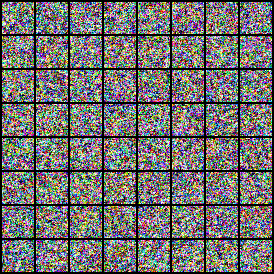
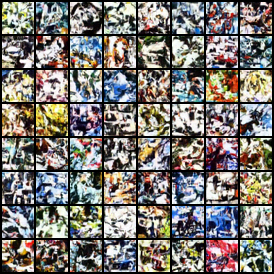
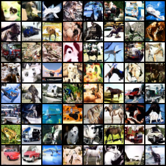
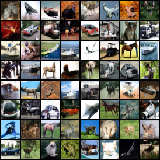

# DDPM from Scratch — CIFAR-10

A from-scratch PyTorch implementation of **Denoising Diffusion Probabilistic Models** ([Ho et al., 2020](https://arxiv.org/abs/2006.11239)), trained on CIFAR-10 at 32×32. Every component — the noise schedule, the time-conditioned U-Net, EMA, and the ancestral sampler — is built and verified from the ground up in a single annotated notebook.

## Samples

Fixed-seed samples from the EMA model at increasing training steps (same latent noise throughout, so you can watch structure emerge):

| 5k steps | 20k steps | 35k steps | 50k steps |
|:---:|:---:|:---:|:---:|
|  |  |  |  |

## What's implemented

- **Forward process** — variance-preserving linear β schedule, closed-form `q_sample` for direct jumps to any timestep.
- **U-Net** (~38M params) — sinusoidal timestep embedding, residual blocks with **scale-shift (AdaGN) time conditioning**, self-attention at 16×16, and channel-concatenation skip connections. Zero-initialized output head.
- **Training** — the simplified ε-prediction objective (MSE between predicted and true noise), Adam, and an exponential moving average of the weights for sampling.
- **Sampling** — full ancestral (DDPM) sampler over all 1000 steps, with `x₀` clamping and the correct posterior variance.

## Architecture

| Component | Choice |
|---|---|
| Prediction target | noise (ε) |
| Time conditioning | scale-shift / AdaGN, per residual block |
| Attention | self-attention at 16×16 resolution |
| Base channels | 128, with (1, 2, 2, 2) multipliers |
| Schedule | linear β, 1e-4 → 0.02, T = 1000 |
| EMA decay | 0.9999 |
| Batch size | 128 |

## Usage

The entire pipeline lives in [`ddpm_cifar10.ipynb`](ddpm_cifar10.ipynb), organized as a sequence of build-and-verify cells:

1. Config, data (CIFAR-10 in `[-1, 1]`), and the β/ᾱ schedule tables.
2. The building blocks — timestep embedding, residual block, attention — each with a shape/gradient check.
3. The full U-Net, verified by parameter count and a zero-init forward pass.
4. EMA, the loss function, and an **overfit gate** (memorize 128 images) that certifies the whole train→sample pipeline before committing to a full run.
5. The training loop, with periodic fixed-seed sampling and checkpointing.

Run top to bottom. CIFAR-10 downloads automatically. A single modern GPU trains to recognizable samples in a few hours.

```bash
pip install torch torchvision matplotlib
jupyter notebook ddpm_cifar10.ipynb
```

## Notes

- The model predicts noise; sampling is evaluated on the **EMA weights**, which matters a lot for sample quality.
- The training loss plateaus early (~0.03) while sample quality keeps improving for tens of thousands of steps — track the sample grids, not the loss.
- Time conditioning uses the scale-shift variant rather than plain additive injection, which is why the parameter count (~38M) sits slightly above the original paper's 35.7M.

## References

- Ho, Jain, Abbeel. *Denoising Diffusion Probabilistic Models.* NeurIPS 2020.
- Nichol, Dhariwal. *Improved Denoising Diffusion Probabilistic Models.* 2021.
